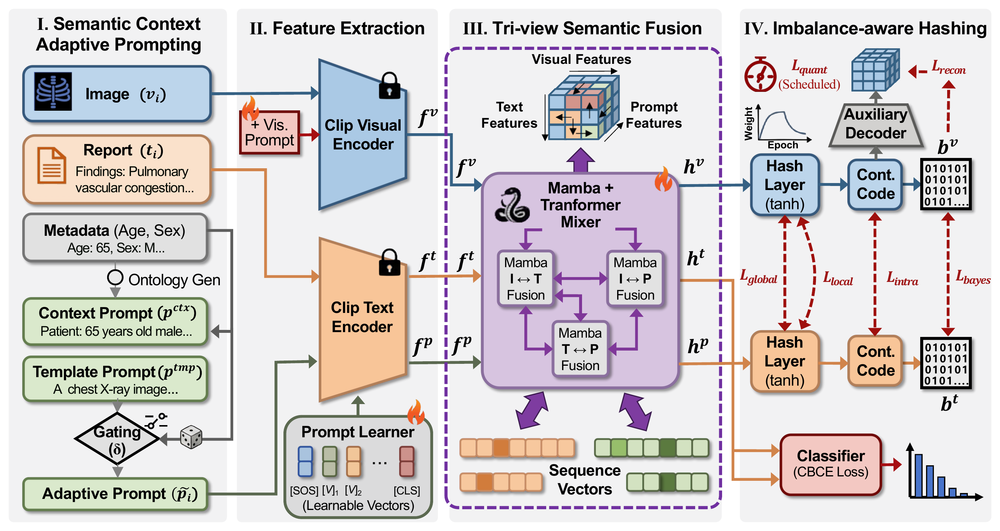

# TriPAH: Imbalance-Aware Tri-Prompt Affinity Hashing for Cross-Modal Medical Retrieval

**Jiaming Bian, Songming Li, Yurui Song, Yunfei Chen<sup>&#42;</sup>, Yichao Cao<sup>&#42;</sup>, Jun Long<sup>&#42;</sup>**<br>
Big Data Institute, Central South University, Changsha, China<br>
<sup>&#42;</sup> **Co-corresponding authors**

**Accepted at ICME 2026 as an Oral presentation.**

[Project page](https://tripah.rainy-elm-2952.chatgpt.site) · [arXiv](https://arxiv.org/abs/2606.27010) · [Paper PDF](website/assets/tripah-paper.pdf) · [Code](https://github.com/Medical-Multi-Agent-AI/TriPAH) · [Data resources](https://huggingface.co/datasets/Jiaminggod/TriPAH)

TriPAH learns compact binary representations for bidirectional retrieval between medical images and clinical text. It combines image, text, and prompt views to address noisy clinical language, long-tailed labels, and unstable quantization.



## Method

The manuscript introduces three complementary components:

- **Semantic context adaptive prompting:** ontology-grounded patient context provides a complementary semantic view, with stochastic fallback to reduce dependence on specific prompt patterns.
- **Tri-view semantic fusion:** Mamba–Transformer blocks model pairwise interactions among image, text, and prompt representations.
- **Imbalance-aware multi-task hashing:** class-balanced supervision and asymmetric progressive quantization preserve semantic structure in compact hash codes.

The implementation uses a MetaCLIP ViT-B/16 backbone and jointly supports multiple target code lengths, with an auxiliary hash branch for reconstruction.

## Reported results

Mean average precision (mAP, higher is better), averaged over **32-, 64-, and 128-bit** codes in Table I of the [manuscript](website/assets/tripah-paper.pdf):

| Dataset | Image → Text | Text → Image |
| --- | ---: | ---: |
| ODIR-5K | 0.937 | 0.977 |
| MIMIC-CXR | 0.820 | 0.889 |
| IU-Xray | 0.896 | 0.896 |

These are results reported in the manuscript. The commands below document the current source-code entry points and defaults; they are not a claim that a fresh run of this release has reproduced the table. Match the paper's preprocessing, splits, optimizer, and training configuration when reproducing its experiments. In particular, the dataset wrappers currently use different split sizes and optimizer settings from the manuscript; see the training defaults below and `train_asym.py`.

## Installation

Use Linux or WSL with an NVIDIA GPU and a CUDA-compatible PyTorch installation for the Mamba modules. The existing development environment uses Python 3.12, PyTorch 2.7.1 with CUDA 12.8, and `mamba-ssm` 2.2.5. An installation for that PyTorch stack is:

```bash
git clone https://github.com/Medical-Multi-Agent-AI/TriPAH.git
cd TriPAH

conda create -n tripah python=3.12 -y
conda activate tripah
python -m pip install --upgrade pip
python -m pip install torch==2.7.1 torchvision==0.22.1 torchaudio==2.7.1 \
  --index-url https://download.pytorch.org/whl/cu128
python -m pip install packaging ninja
python -m pip install --no-build-isolation causal-conv1d mamba-ssm==2.2.5
python -m pip install -r requirements.txt
```

Mamba and causal-conv1d contain compiled CUDA extensions; their builds or wheels must match the installed Python, PyTorch, and CUDA environment. See the upstream [Mamba](https://github.com/state-spaces/mamba) and [causal-conv1d](https://github.com/Dao-AILab/causal-conv1d) installation instructions when using another stack. `requirements.txt` lists dependency bounds rather than a fully locked environment.

The backbone is `ViT-B-16-quickgelu` with `metaclip_fullcc` weights. Training initializes it through the bundled OpenCLIP implementation. To use a local compatible backbone checkpoint, append:

```bash
--clip-pretrained /path/to/open_clip_pytorch_model.bin
```

This option supplies **backbone** weights; `--pretrained` supplies a trained **TriPAH** checkpoint.

## Prepare the data

Dataset sources and preparation notes for all three benchmarks are available in the [Hugging Face resource repository](https://huggingface.co/datasets/Jiaminggod/TriPAH). That public repository currently contains documentation only; restricted source records are not redistributed.

Obtain ODIR-5K, IU-Xray, or MIMIC-CXR from their respective providers and follow their access conditions. Raw images, reports, generated dataset files, pretrained weights, and experiment checkpoints are not distributed in this repository.

Run the converters from the repository root, supplying the location of your raw data:

```bash
python -m dataset.builders.convert_odir_dataset \
  --root /path/to/ODIR-5K --output dataset/odir

python -m dataset.builders.convert_iuxray_dataset \
  --root /path/to/IU-Xray --output dataset/iu-xray

python -m dataset.builders.convert_mimic_dataset \
  --root /path/to/mimic-cxr-jpg --output dataset/mimic-cxr
```

Expected raw inputs:

- **ODIR-5K:** `data.xlsx` and `Training_Images/` or `Training Images/`. Use `--train-dir /path/to/images` to specify another image directory. The converter combines left and right fundus images into binocular samples.
- **IU-Xray:** `indiana_reports.csv`, `indiana_projections.csv`, and `images/`.
- **MIMIC-CXR:** the metadata, split, CheXpert, and NegBio CSV files; `cxr-record-list.csv`; `cxr-study-list.csv`; and the image/report directory layout in `MIMICToODIRConverterOptimized`. Check the constructor in `dataset/builders/convert_mimic_dataset.py` against your local export before conversion.

When `--root` is omitted, the converters use `ODIR_ROOT`, `IUXRAY_ROOT`, or `MIMIC_CXR_ROOT` if set. Their shared fallback is `TRIPAH_DATA_ROOT` (default: `./data`); see `utils/image_path.py` for the raw directory defaults. Converted training data use the separate `dataset/<dataset>/` directories:

```text
dataset/
├── odir/
├── iu-xray/
└── mimic-cxr/
    ├── images/
    ├── caption.txt
    ├── index.mat
    ├── label.mat
    └── prompt_caption.npz
```

Each converted dataset has the same five required entries shown above. Rows in captions, image indices, labels, and prompt arrays must remain aligned. `prompt_caption.npz` supports `prompt_caption_ids` (token IDs) or `prompt_caption` (token embeddings), plus optional `patient_context_ids` or `patient_context` arrays. Conversion can initialize the pretrained text encoder and download its weights. Inspect conversion output and prompt arrays: zero-filled fallback features do not provide the intended semantic prompts.

The loader performs a seeded **sample-wise** permutation. Queries are held out first; the training subset is selected from the remaining samples; the retrieval database includes all non-query samples, including training samples. This does not by itself enforce patient-disjoint splits or the original MIMIC-CXR split assignments. Keep the converted row ordering, seed, query count, and training count identical between training and evaluation.

## Train

The dataset-specific entry points enable training and supply dataset defaults. Command-line arguments override these defaults:

```bash
python train_odir.py --k-bits-list 32,64,128
python train_iuxray.py --k-bits-list 32,64,128
python train_mimic.py --k-bits-list 32,64,128
```

Current wrapper defaults:

| Entry point | Dataset | Query samples | Training samples | Epochs | Learning rate |
| --- | --- | ---: | ---: | ---: | ---: |
| `train_odir.py` | `odir` | 351 | 2,275 | 100 | 0.002 |
| `train_iuxray.py` | `iu-xray` | 380 | 2,500 | 100 | 0.001 |
| `train_mimic.py` | `mimic-cxr` | 10,000 | 58,141 | 80 | 0.001 |

All three wrappers use seed `42`; the shared batch-size default is `96`. The trainer uses `BertAdam` from `optimization.py`. Inspect the selected wrapper and `python main.py --help` for all settings, including dataset-specific loss weights. Ensure that the converted dataset contains at least `query-num + train-num` samples.

For example, a single-length ODIR run with mixed precision is:

```bash
python train_odir.py --k-bits-list 64 --epochs 100 \
  --use-amp true --amp-dtype bf16 --exp-tag odir64
```

Use a precision supported by your GPU. Logs and the best checkpoint (`model_best.pth`) are written below `result/Result_TriPAH_*` by the wrappers. Set `--result-name` to choose another output root. Visdom plots are optional; start the server in another terminal if desired:

```bash
python -m visdom.server -port 8097
```

## Evaluate

Use `main.py` without `--is-train`. Supply the trained checkpoint and the same model configuration and dataset split as the training run:

```bash
python main.py --dataset odir --caption-file caption.txt \
  --pretrained /path/to/model_best.pth \
  --k-bits-list 32,64,128 --query-num 351 --train-num 2275 --seed 42 \
  --result-name result/evaluation --exp-tag odir
```

For IU-Xray or MIMIC-CXR, change the dataset and split sizes to match the run being evaluated. Match architecture options such as `--k-bits-list` and `--auxiliary-bit-dim`; preserve any ablation flags. Reported logs include image-to-text and text-to-image mAP. Exported `.mat` files contain query/retrieval image and text codes and their labels under the run's `mat_results/` directory.

## Ablation controls

Append these arguments to a training command to study individual components. Use the same settings again when evaluating the resulting checkpoint.

| Experiment | Arguments |
| --- | --- |
| Disable Mamba–Transformer fusion | `--disable-fuse-mamba` |
| Disable the prompt representation | `--disable-prompt` |
| Disable auxiliary reconstruction | `--disable-recon` |
| Disable prompt alignment losses | `--hyper-local 0 --hyper-global 0 --hyper-text-prompt 0` |
| Disable affinity losses | `--hyper-cls-intra 0 --hyper-cls-inter 0` |
| Disable quantization loss | `--hyper-quan 0` |
| Disable class-balanced classification | `--hyper-cbce 0` |
| Select a single target code length | `--k-bits-list 32` |

## Repository layout

```text
hash_model.py          TriPAH encoders, prompt learner, fusion, and hashing heads
train_asym.py          Trainer, losses, evaluation, and checkpoint export
main.py                Shared training/evaluation command-line entry point
train_{odir,iuxray,mimic}.py
                       Dataset-specific training defaults
load_data.py           Dataset loading, transforms, prompts, and splits
dataset/builders/      Dataset conversion and validation utilities
model/                 Model modules and bundled OpenCLIP implementation
utils/                 Arguments, metrics, logging, and raw-data paths
tools/                 Experiment scripts and result collection
examples/              Retrieval visualization utilities
website/               Public project page, paper, and figures
```

## Citation

If you use TriPAH in your research, please use the following arXiv citation:

```bibtex
@article{bian2026tripah,
  title={TriPAH: Imbalance-Aware Tri-Prompt Affinity Hashing for Cross-Modal Medical Retrieval},
  author={Bian, Jiaming and Li, Songming and Song, Yurui and Chen, Yunfei and Cao, Yichao and Long, Jun},
  journal={arXiv preprint arXiv:2606.27010},
  year={2026}
}
```

## License and acknowledgements

The repository retains its [Apache 2.0 license](LICENSE). See [THIRD_PARTY_NOTICES.md](THIRD_PARTY_NOTICES.md) for upstream attribution and component-specific terms. The implementation builds on prior open-source hashing code and includes components from [OpenCLIP](https://github.com/mlfoundations/open_clip), [MetaCLIP](https://github.com/facebookresearch/MetaCLIP), [Mamba](https://github.com/state-spaces/mamba), and [CMCL](https://github.com/DarrenZZhang/CMCL). Bundled components retain their respective licenses and original copyright notices.

For project and code questions, please [open an issue](https://github.com/Medical-Multi-Agent-AI/TriPAH/issues) or contact [Jiaming Bian](mailto:bianjiaming@csu.edu.cn). The paper's co-corresponding authors are Yunfei Chen, Yichao Cao, and Jun Long.
